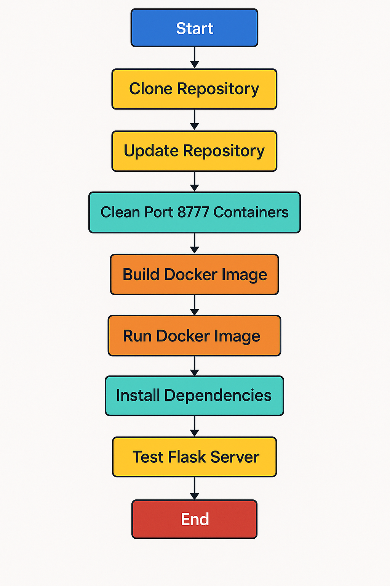

#   ������������������������������������������������������ ℙ������������������������������������
#       ������������������������������ ℍ������������������������������

In this project I built three Games:

### CurrencyRoulette Game:
This game challenges the user to guess the value in ILS (Israeli Shekel) of a randomly generated amount in USD. The current exchange rate is fetched live using a currency API. Based on the difficulty level, a tolerance interval is calculated around the correct ILS value, and the user wins if their guess falls within that range.

### Guess Game:
In this simple number guessing game, the system generates a random number between 1 and the chosen difficulty level. The player must guess the exact number to win. The game ensures input validation and provides appropriate feedback.

### Memory Game:
This game tests the user's short-term memory by displaying a sequence of random numbers for a brief period (default 10 seconds). The user must recall and enter the exact sequence in the correct order. Winning depends on accurate memory recall.

  

## Jenkins File Explenation:
- The pipeline runs on any available node.
- Before the pipeline I defined an 'environment' block that defines a DOCKERHUB REPO that I will use through the entire pipeline.

### STAGES:
- Clone Repository stage:
   * This stage clones the repository from GitHub into the Jenkins workspace.
   * It uses Git credentials (my_secret_token) for authentication.
   * It checks out the main branch.
   * Cloning the repository every time we run Jenkins file ensures Jenkins has the latest code before running the pipeline.
- Update Repository stage:
   * update all the branches of the clonned repository.
   * ensures the local repository is the same as the remote one (or cloned one).
- Clean Port 8777 Containers stage:
   * This stage was made to check if port 8777 is availabe and if not to delete the containers that are running in the port.
   * checks if any container is running on port 8777, if there were it will stop it and delete it, if not it will continue.
- Build Docker image:
   * Now, the Flask server Docker image is built from scores.py python file.
   
#### Scores.py File:
   * This Score.py script manages a simple scoring system for a game, where the user's cumulative score is stored in a file called scores_file.txt.
   * It first checks whether the scores_file.txt exists in the same directory as the script. If it doesn’t, it creates the file and initializes the score to 0.
   * Then it reads the current score, adds the new winning points, and writes the updated score back to the file.
   * The script uses os.path to handle paths in a portable way and ensures the file is updated in-place using f1.seek(0).

- Run Docker image stage:
   * Removes all the old containers that has the same name of the flask server container.
   * Then, runs the Docker image as a background service, accessible on port 8777.
- Install Dependencies stage:
   * Removes any virtual environment folder.
   * create a new virtual environment folder.
   * activates the virtual environment.
   * install all the dependencies.
- Test Flask Server stage:
   * activating the virtual environment.
   * running the e2e.py, that connects to the server that was created and ran in the docker container,  in order to get to the scores text file and read it.

#### e2e.py File:
This script is an automated end-to-end test for a web service that displays a user score on a web page. It uses Selenium to verify that the score shown is a valid number between 1 and 1000.

- Finalize stage:
   * First, we log into Docker securely, fetching credentials from Jenkins credentials, docker's user_name and password.
   * tagging the docker image.
   * push Docker image into my personal Docker hub.
   * Logs in to Docker securely using --password-stdin, which avoids exposing the password in the process list.
   * Tags the image with a versioned tag, using the current Jenkins build number as the tag.
   * Pushes the tagged image to Docker Hub.

- POST Block:
   * Clean up the workspace by deleting its contents after each build.
   * This practice helps prevent potential issues caused by residual files from previous build.